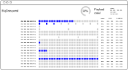

# Crawling Big Classified Ads Multipaged Portal with Frontera and Scrapy

## What is Classified Ads Multipaged Portal

Sometimes customers ask to extract data from websites, stuffed with tons of classifieds like companies advertisments, job offerings, goods listings etc. We call such websites Classified Ads Multipaged Portal and will name it here just **portal** for simplicity.

Often such portals have a **search** box in the main page, which leads you to **listing pages** when you enter a search criteria. Every classified ad on the listing (which we will refer as **item**) contains mostly brief information like name, address, web, which we need to scrape. Also, the customer may ask you to grab additional details from item **details page**, which you can get when you click on a classified ad.

The customer gives you about dozen or two of search criterias which we inject into our scraping system as initial (**seed**) URLs (via a text or CSV file) and the process begins.

Below is a typical structure and workflow to do a job:

{.center}

## Problem Statement: Why do we need a "Job State Persistency" in our Scraper

If we’re talking about scraping a portal, which contains hundreds of thousands records, **it is unlikely that we will do all our job in a single session**. Several reasons may be for that – perhaps we want to inspect the portion of the data collected before proceeding further (which is definitely a good practice!) or we know that, if we exceed some amount of requests the site will temporary ban us so we need to stop and recharge the session after waiting some time, etc.

Furthermore, we must be prepared to face with errors and session breakdowns on whatever step. Never can we expect that data or webpages are always uniform and therefore we may catch an error, which we could not ever imagine.

That is why we need to maintain persistency in our scraper - to be able to start exactly from the point where we finished before. This way we need the mechanisms to handle the following use cases:

- skip already processed searches
- skip already processed pages within firm listing of a category
- (optional) avoid duplicates in scraped items

After some experience with "handmade" solutions, we considered to use [Scrapinghub's open source] [Frontera] package, which does exactly what we need: keeps the scraping job state persistent in a database so we can keep calm that scraper will restart exactly from where it stopped and nothing will be missed.

## Able to see Job Progress: Discovery Crawls and Payload Crawls

Scraping a huge portal may take hours and even days. Obviously it is a good idea to see where we are and, more important, to see when we finish. To make such "progress indicator", we must know how much work we have in total. Coming back to our multipaged portal, this "work estimation" process can be expressed as **discovery crawl** to do the following:

- walk only across paging links first
- record amount of pages when we reached the last page within each search
- record amount of items on each page - to signal when a particular page is completed during **payload crawl** and to calculate overall total

Next two items are not related directly to discovery process but should be implemented at discovery crawl stage in order not to do same work twice:

- collect links to items details pages
- scrape information about items which is already available on listing pages

Due to it's built-in mechanism of **link scoring**, [Frontera] package is able to handle such two-phase crawl mechanism with just small alterations in code.

Last, to illustrate discussed above, we provide an idea how scraper monitoring dashboard may look like:

{.center}

{.center}

## Frontera Single Process Workflow

Scraping job using Frontera starts with injecting into the system an initial requests, which are called **seeds**. This injection is performed via separate small script, which saves the seeds directly into the database (Queue table).

After that you turn the key and the system starts. The drive unit in the circle is Scrapy Engine, which periodically asks Frontera Scheduler for new requests. Then Scrapy fires the requests into Internet, extract new links from responses, convert these links into new Requests and push them back to the Scheduler. Now this is Frontera's turn.

The goal of crawling frontier is to save, arrange, order and deliver new requests to spiders. The scheme below introduces the Frontera functionality. From this scheme we will see where to insert our customized functionality - Job State Persistency and Job Progress Reporting.

{.center}

## WebPilot protocol

First, let us discuss briefly the Scrapy part of the work. We mentioned above that Scrapy extracts new links form pages he visited. On the ads portal workflow scheme we see that, on Listing Pages there are two types of links: Paging link (B) and Item details links (C). We need to identify each link precisely: what kind of link it is, where it originated from and what it targets to.

The situation is that links actually originating in the Scrapy side, but will be handled on the Frontera side. Therefore they must communicate the link details and understand each other. We must agree on data formats and we propose to establish this as **WebPilot protocol**.

1. Both Scrapy and Frontera have (by design) special field called `meta` to store arbitrary information in the `Request` and `Response` classes.
2. Block of information about link is called `flight` and to be stored in meta inder `meta['flight']` key.
3. `meta['flight']` data structure must be carried out through the whole (single) Request-Response-Request-Response... chain. The fact is that the frameworks copy meta field form `Request` to `Response` automatically, but **do not do so** for `Request`s, **newly born from extracting links** from `Response` webpage.
4. To describe `flight` data structure, first we show the scraping process from Fig. 1 in simplified form but showing the `meta['flight']` examples.

[Scrapinghub's open source]: https://scrapinghub.com/open-source
[Frontera]: https://github.com/scrapinghub/frontera
